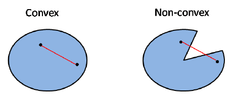
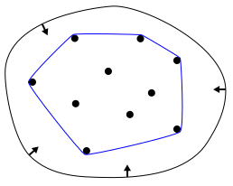
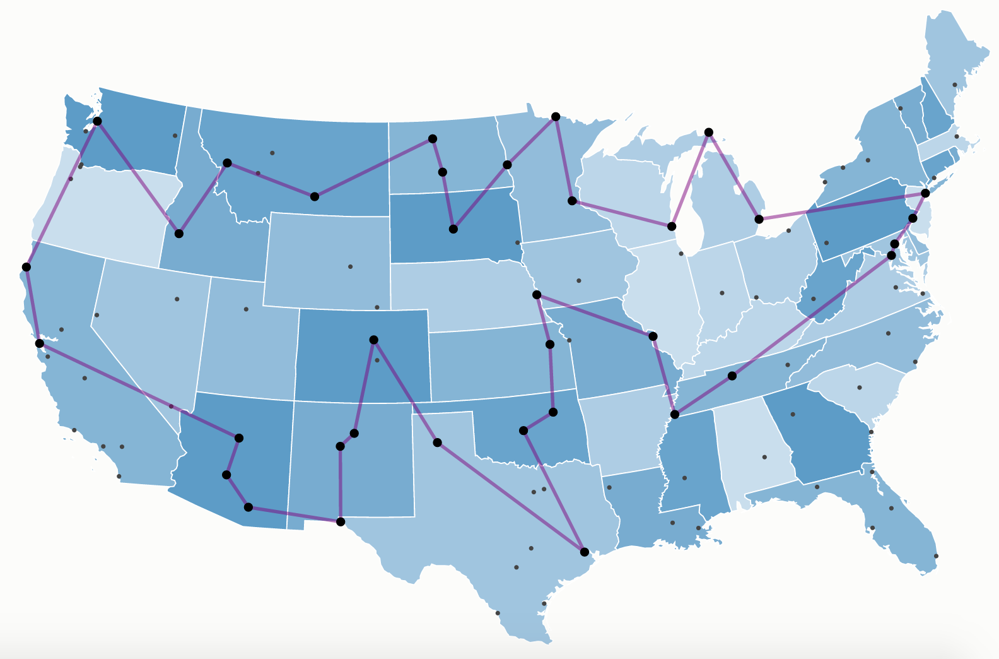

### Exercises 1.1-1
---
Give a real-world example that requires sorting or a real-world example that requires computing a convex hull.

#### `Answers`

In binary search, the list must be previously sorted before any searching operation.

First, we need to understand what convex set is. A set can be said as "convex" if you take two points inside that set and draw a line, those line have to lie completely within that set.

Convex hull is the smallest shape that wraps a  convex set.

Example of real-world scenario where convex hull calculation is needed is in several Computer Vision scenario.

---

### Exercise 1.1-2
---
Other than speed, what other measures of efficiency might one use in a real-world setting?

#### `Answers`

1. Memory usage
2. Degree of Parallelism
3. Resource usages (I/O constraint, read-write ratio, optimal CPU/GPU clock speeds)
4. Stability (for incorrect but practical alghoritm with controlled error rate)
5. Result entropy-level (for encoding or compression)

---

### Exercise 1.1-3
---

Select a data structure you have seen previously, and discuss its strengths and limitations

#### `Answers`

Linked list

Strengths

1. Dynamic sized
2. Insertion and deletion is easy
3. No need for memory pre-alocation, allocation done in runtime

Limitations

1. Traversal (slow if you need to access index in center of chain)
2. Extra memory needed to save pointer
3. No reverse traversing (in single linked list), implementing reverse treversing cost extra memory

---

### Exercise 1.1-4
---
How are the shortest-path and traveling-salesman problems given above similar? How are they different?

#### `Answers`

Traveling-salesman and shortest-path have similar outcome it wants to solve, a path with the "lowest overall distance", but in Traveling-salesman you have to find a path that contains a permutation of every nodes. While shortest-path problem you don't have to includes all nodes, you just have to find a path with shortest distance from node point to another given a set of nodes.

Here's simple example of both problems. Consider traveling salesman map to reach several states in US below

In traveling-salesman problem, you problem might sounds like: what is the shortest path to reach all nodes (states capital) in US?

Meanwhile in shortest-path problem, the problem might only stated such, what is the shortest path to get from Sacramento, California to Albany, New York via land?

Other aspect that differs this two problems is the fact that Traveling-salesman is NP-complete problem while shortest-path problem is a P problem (can be solved in polynomial time)

Reference about P and NP problem: https://www.youtube.com/watch?v=EHp4FPyajKQ

---

### Exercise 1.1-5

---

Come up with a real-world problem in which only the best solution will do. Then come up with one in which a solution that is “approximately” the best is good enough.

#### `Answers`

This question is really abstract, but example of problem that need the best solution is something like surgery robotic arm, it needs the most precise and battle-tested algorithm to be implemented to make sure its not faulty during its procedure. 

In real-life product like [Da Vinci Surgery System](https://www.davincisurgery.com/)

Meanwhile real-world problem which a solution that uses approximation for its solution is good enough might be problem like calculating time needed to get from point A to B to tell customer how long should they expect before picking up their order.